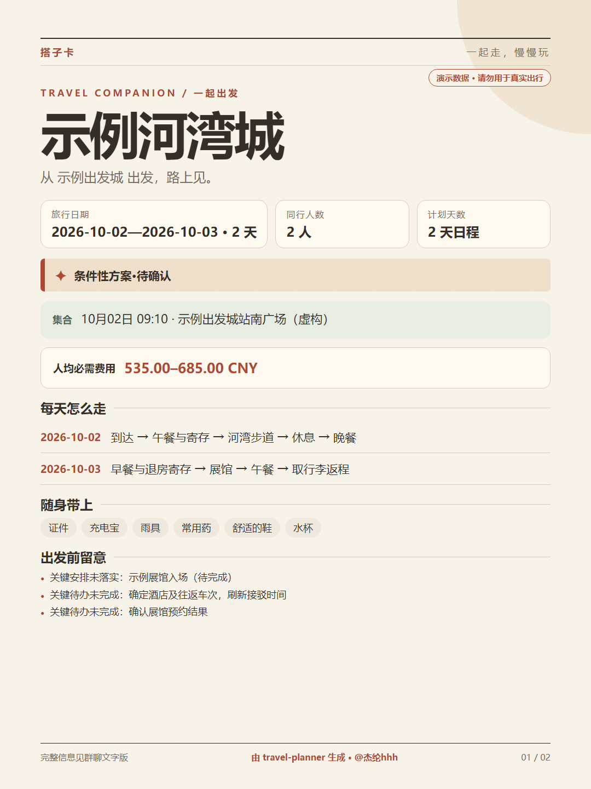

# 旅行规划 Skill

从一句模糊的出行想法开始，逐步了解旅行偏好，比较目的地，整理可核实的行程，并导出可离线阅读的手机旅行手帐。


> 截图和 `assets/demo-plan.json` 使用虚构地点、价格与订单，仅用于展示效果，不能作为真实出行依据。

## 灵感与致谢

开发这个 Skill 时，我受到了 [不一书旅行规划（bys-travel-plan）](https://github.com/qkgecn93/bys-travel-plan) 的对话式旅行规划思路，以及 [travel-plan-viz](https://github.com/zexuanw958-svg/travel-plan-viz) 将行程做成手机优先、可离线阅读网页的方式的启发。感谢两个项目的作者公开分享作品。

## 接入 Codex、WorkBuddy、豆包工作和 TraeCode

这个 Skill 是一个包含 `SKILL.md`、`references/`、`scripts/` 和 `assets/` 的文件夹。安装时要保留整个文件夹；只导入 `SKILL.md`，旅行手帐的模板和导出脚本就无法使用。导出 HTML 需要本机可运行 `python`（Python 3）；只讨论旅行方向时不需要运行脚本。

### Codex

把仓库克隆到用户级 Skill 目录：

```powershell
# Windows PowerShell
git clone https://github.com/xiaogongonline/travel-planner.git "$HOME\.codex\skills\travel-planner"
```

```bash
# macOS / Linux
git clone https://github.com/xiaogongonline/travel-planner.git "$HOME/.codex/skills/travel-planner"
```

安装后打开新的 Codex 任务，发送“请使用 $travel-planner。国庆想出去玩，但还没想好去哪。”，检查它是否先了解出发地等关键条件。目录已存在时先检查原有内容；`git clone` 不会替你覆盖或更新它。

### 先准备给其他工具导入的 ZIP

在 [GitHub 仓库](https://github.com/xiaogongonline/travel-planner) 点击 **Code → Download ZIP** 并解压，或把仓库克隆到任意空目录。然后把解压后的 `SKILL.md`、`references/`、`scripts/`、`assets/` 一起压成一个 ZIP：打开 ZIP 后应直接看见 `SKILL.md`，不能只看见上一层仓库文件夹。不要选单独的 `SKILL.md`，也不用把 `.git` 放入包中。

Windows PowerShell 示例（先在包含 `SKILL.md` 的目录执行）：

```powershell
Compress-Archive -Path SKILL.md,references,scripts,assets -DestinationPath "$HOME\Downloads\travel-planner-skill.zip"
```

目标 ZIP 已存在时先另取文件名，避免混淆新旧版本。

### WorkBuddy

打开 **专家 · Skills · Connectors → Skills → 添加技能 → 上传技能**，选择上面的 ZIP；安装后在“已安装”中确认“旅行规划”已启用，再新建对话说“用 travel-planner 帮我规划一次旅行”。界面名称若有变化，以 [WorkBuddy 技能说明](https://www.workbuddy.cn/docs/workbuddy/From-Beginner-to-Expert-Guide/Function-Description/Skills-Market) 为准。

### 豆包工作

先在桌面客户端的技能管理中找“添加／导入本地技能”入口；如果当前版本提供该入口，选择上面的完整 ZIP，确认导入后能看到 `travel-planner`，再开新对话明确说“使用 travel-planner 技能，先了解我想怎么玩”。不同版本的导入方式可能不同；目前尚未完成豆包工作的实际导入与调用验证。如果界面没有导入入口，不要把普通豆包聊天的“技能”功能当作已安装本地 Skill。

### TraeCode（TRAE）

打开 **设置 → 技能与命令 → 技能 → 创建**，选择“全局”或“项目”，导入上面的完整 ZIP，然后确认技能名称和描述并启用。全局技能适合跨项目使用，项目技能只用于当前项目。详见 [TraeCode 官方技能文档](https://docs.trae.cn/ide_skills)。

不论用哪个工具，安装后都用一个新对话试运行。只给“国庆想出去玩”时，预期是先问出发地、天数和旅行偏好；看到完整日程或 HTML 不代表接入正确。

## 怎么用

不必先填完整表格。可以从一句话开始：

```text
请使用 $travel-planner。国庆想出去玩，但还没想好去哪。
```

也可以说明已知条件：

```text
请使用 $travel-planner。我从广州出发，国庆有四天，两个人，总预算 3000 元，不想早起，还没决定去哪。
```

已有行程时，可以只改一部分或做出发前检查：

```text
使用 $travel-planner，把已有行程的酒店换到这个地址，检查哪些交通、预算和预约需要调整。
```

Skill 会根据当前阶段工作：偏好和目的地尚未明确时先交流、比较；关键选择清楚后再排详细日程。需要查询营业、交通、价格或预约规则时，它会使用当前环境实际可用的搜索、地图或浏览器工具，保留来源和适用条件。查不到的事项会留在待核实清单中。

## 导出手机攻略

方向和关键安排明确后，可要求“导出手机离线攻略”。生成的 HTML 包含日程、地址、预算、预约状态和可勾选待办。核心内容直接写在文件里；待办勾选进度只尝试保存在打开它的浏览器中。

导出工具使用 Python 3 标准库，无须安装额外 Python 包。通常由 Codex 维护计划数据并调用脚本；也可以手动运行：

```text
python scripts/travel_plan.py init <work>/plan.json
python scripts/travel_plan.py check <work>/plan.json
python scripts/travel_plan.py render <work>/plan.json --out <work>/travel-plan.html
python scripts/travel_plan.py audit <work>/travel-plan.html
```

`init` 只生成待填骨架，不是旅行方案。未落实关键预约等事项时，`render` 仍可生成醒目标记的条件性草案，不能据此认定行程已经可出发。

旅行手帐的页脚署名为“由 travel-planner 生成 · @杰纶hhh”；如在 `plan.json` 的 `card.author` 填入其他名字，手帐和搭子卡会使用同一署名。

## 做一张搭子卡

行程有了方向后，可以说“做个搭子卡发群里”。Skill 会把每天的安排、集合、必带物品和人均必需费用整理成图片；对话里已有分工、投票或 AA 数据时才显示对应模块。图片太满会自动分成多张，另有可直接粘贴到微信群的文字版。卡片不发送消息，群友通过回复编号和接龙互动。




演示图片使用虚构地点与支出。底部署名为“由 travel-planner 生成 · @杰纶hhh”。

本地命令：

```text
python scripts/travel_plan.py card <work>/plan.json -o <work>/dazi-card
```

脚本使用 Python 3 标准库，并调用机器上已有的 Chrome 或 Edge 自动生成 1080×1440 PNG。用户不用打开网页或点保存；`dazi-card.txt` 是群聊文字版，`dazi-card.html` 是内部排版与离线预览文件。没有本机浏览器时，支持浏览器工具的 Agent 可以接着自动截图；若都不可用，应如实报告图片未生成。正式行程请先核对卡片上的公开内容，再分享给同行者。CLI 默认不覆盖，明确加 `--force` 才覆盖。

## 能力边界

- 实时事实取决于使用时可用的查询工具；Skill 本身不提供地图 API、票价库存或持续监控。
- 它不代购、付款或预约。营业时间、交通和订单在出发前仍需按最新情况复核。
- HTML 的核心内容可离线读，但来源链接和实时导航需要联网。手机本地文件的打开方式因设备而异，建议出发前在自己的手机上试开。

详细规则见 [SKILL.md](SKILL.md)。脚本检查可运行 `python scripts/test_travel_plan.py`。

## 许可

MIT License，见 [LICENSE](LICENSE)。
